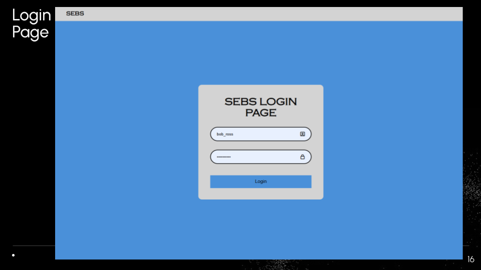
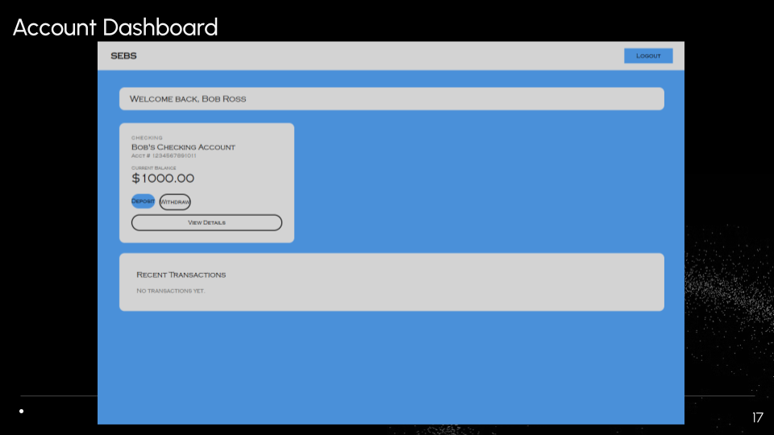
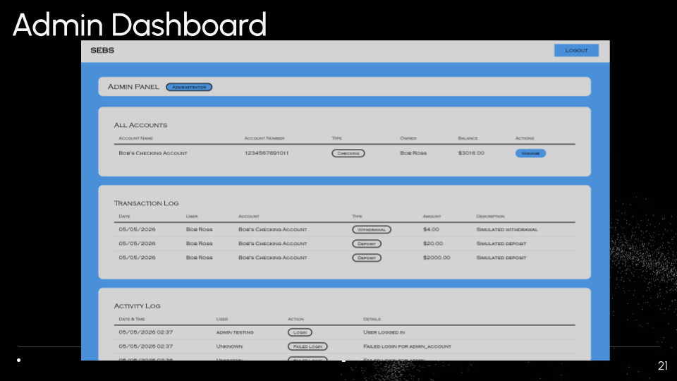
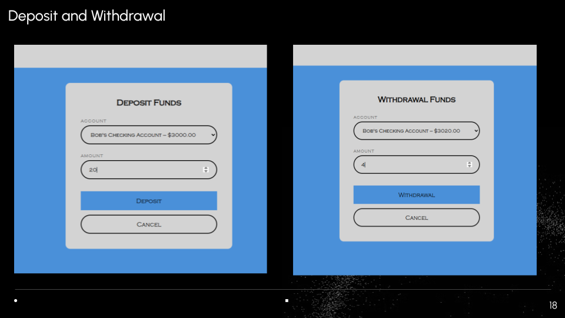
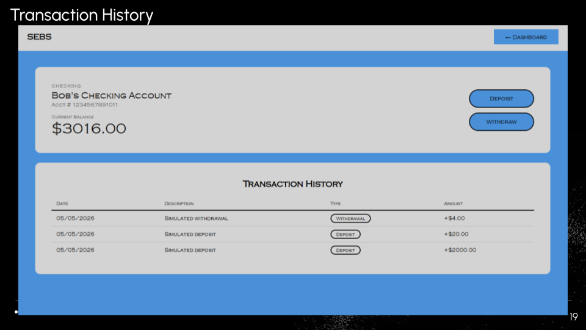
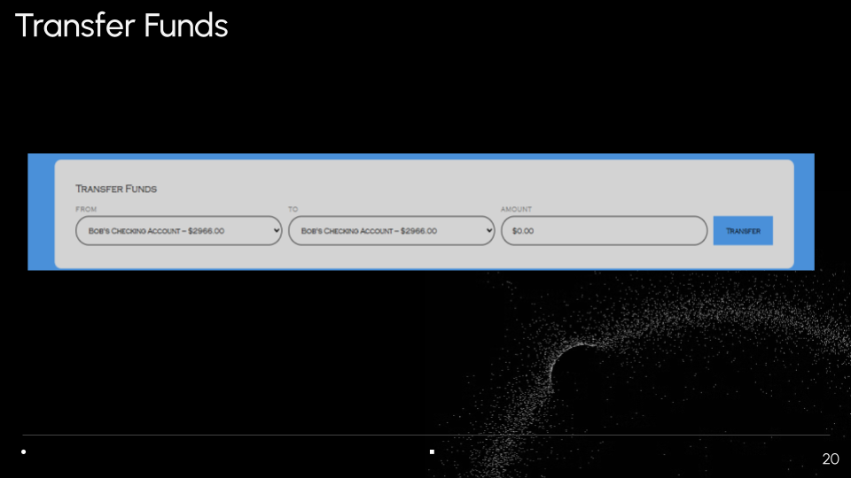

# Simulated E-Banking System (SEBS)

Built by Regan Cunningham, Dylan Chamberlin, Jacob Dell, Aiden Grimsey

A locally hosted web banking application built with Django, simulating real-world banking operations including account management, deposits, withdrawals, and transfers. Developed as a software engineering course project following a full SDLC process with formal SRS and SDD documentation.

---

## Screenshots








---

##  Demo

WORK IN PROGRESS

---

## Features

- User authentication with role-based access (Customer / Administrator)
- Simulated bank account creation and management
- Deposit, withdrawal, and transfer transaction support
- Activity logging for key system events (logins, failed logins, transfers, admin changes)
- Admin dashboard for managing user accounts
- Consistent balance integrity — failed operations raise errors before modifying data

---

## Project Documentation

Developed following a structured SDLC with formal documentation:

| Document | Description |
|---|---|
| [SRS](docs/SRSD.pdf) | Software Requirements Specification |
| [SDD](docs/SDD.pdf) | Software Design Document |
| [Presentation](docs/SEBS_Slides_Presentation.pdf) | Project overview slides |
| [PMP](docs/SPMP.pdf) | Software Project Management Plan

---

## Tech Stack

| Layer | Technology |
|---|---|
| Backend | Python, Django 6 |
| Frontend | HTML5, CSS3, Django Templates |
| Database | SQLite (via Django ORM) |
| Testing | pytest, pytest-django |

---

## Database Design

The application uses Django models with SQLite. Core entities:

- **User / UserProfile** — Django's built-in auth extended with a customer/admin role field
- **Account** — Stores simulated bank accounts (account number, type, balance) linked to a user
- **Transaction** — Records deposits, withdrawals, and transfers (transfers create two records: source and destination)
- **ActivityLog** — Tracks system events for auditing (logins, failed logins, transfers, admin actions)

---

## Local Setup

**1. Clone the repo**
```bash
git clone https://github.com/regan10444/SE_SEBS_project.git
cd SE_SEBS_project
```

**2. Create and activate a virtual environment**
```bash
python -m venv .venv
.venv\Scripts\activate        # Windows
source .venv/bin/activate     # macOS/Linux
```

**3. Install dependencies**
```bash
pip install -r requirements.txt
```

**4. Run migrations**
```bash
python manage.py migrate
```

**5. Load fixtures (sample data)**
```bash
python manage.py loaddata fixtures/<fixture_file>.json
```

**6. Start the development server**
```bash
python manage.py runserver
```

Visit `http://127.0.0.1:8000` in your browser.

---

## 🧪 Running Tests

```bash
pytest
```

---

## My Contributions

- Designed and implemented all frontend templates and UI using HTML, CSS, and Django's template engine
- Wrote and maintained the test suite using pytest and pytest-django
- Collaborated on system design documented in the SRS and SDD

---

##  Notes

This project was originally developed as a team academic project for a Software Engineering course. This repository is my personal extended version. The system uses simulated data and is intended for demonstration purposes only — not for production use.
